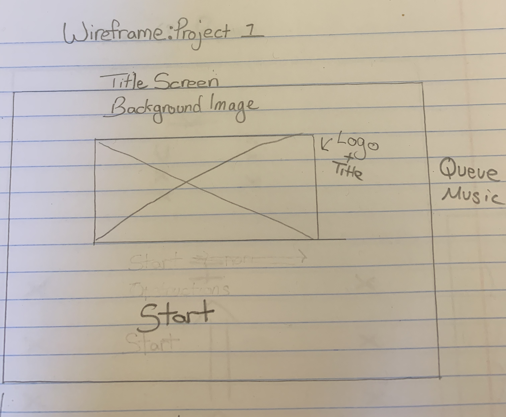
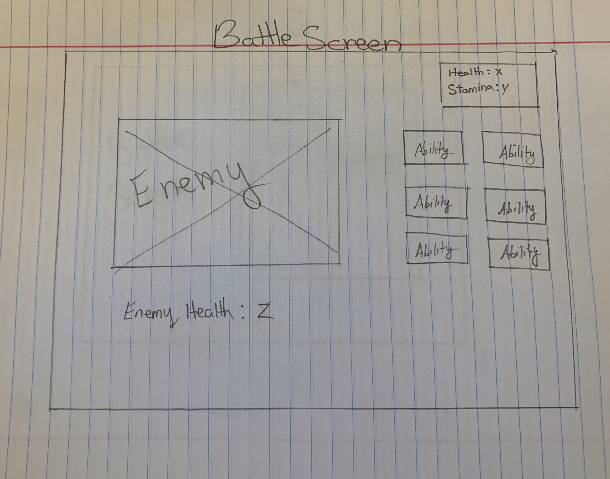

#Wireframes

#Initial Planning:
I knew from the beginning that I wanted to do some kind of RPG game as my first project. After going through several iterations of what I intended to do, I ended up creating a deep-dugeon turn taking RPG (think Darkest Dungeon or Palace of the Dead in Final Fantasy 14). I spent the first few hours of my project just writing psedocode and planning how I wanted to tackle this project.

#Gameplay
The game plays like a deep-dungeon turn taking RPG. You, as the hero traversing have several abilities at your disposal for killing the dragons that are standing in your way. Each ability costs stamina; you also poseess abilities that will help you restore your stamina. There are currently 3 enemies in the game - a dragon, a wyvern, and a treasure chest with 1 hp that has a chance of giving you an item. The game will continue to progress until you run out of HP and your character dies.

You can tackle these enemies with the following abilities:

- Attack: This ability does basic damage and cost 1 stamina.
- Defend: Will increase your defense and allow you to take reduced damage next turn as well as restore 1 stamina.
- Fire: This ability costs 5 stamina and deals moderate damage. This is your most powerful enemy at the cost of the most stamina intensive ability.
- - Heal: You will heal 50hp at the cost of 20 stamina.
- Charge: This will restore your stamina to full but leave you vulnerable the next turn.
- Wait: Pass your turn and restore 10 stamina.

After killing an enemy, you gain experience points depending on what type of enemy you got. Blue dragon gives more exp than the yellow wyvern. 

When you level up, your health and stamina are restored to max to help you progress through the dungoen as long as possible.

If you get a treasure chest, you have a chance at getting one of two items: 
- Health Potion: Will add +10 to your health permanently.
- Stamina Potion: Will add +5 to your stamina permanently.

#MVP
###The MVP for my deep-dungeon RPG consists of the following:
- Start screen
- Battle Menu with magic/abilities
- Said abilities should have sound and visual affects
- Be able to level up with experience and gain stats.
- 2-3 differernt types of enemies with different difficulties.
- 2-3 items that can give permenant stat buffs.

#Basic Game Idea:
- I am planning on making an RPG with turn based deep-dungeon gameplay.
- Several abilities such as Attack, Defend, Fire etc.
- Several differrent enemies with different chances of them showing up.
- Enemies can drop items that can give you stat buffs.
- Can have a chance at getting a treasure chest instead of an enemy for permanent stat buffs.

#Tech
This game was made purely with HTML, CSS, Javascript, and JQuery. 

To create the gameboard, I took a different approach than what others may have done which was use Canvas. I took an image and added borders and margins around it in order to create my gameboard. I addedd the enemies, buttons, hero stats, and spell effects over the image to make it come to life and look like an actual game.

#MVP
- Start screen
- Battle Menu attack
- Add spells and abilities that cost resources
- 2-3 differernt types of enemies.
- Able to level up and gain stats as you get stronger
- Items that can give stat buffs.
- Endless loop of battles until you die.

#Stretch Goals
- Mobile friendly
- effects and sounds for abilities
- Counter showing how many levels you have progressed through
- Hero art
- different difficulty of enemies
- menu showing enemy stats when you click on them
- menu showing hero stats when you click on your health
- Scaling difficulty of enemies

#References
- itch.io
- opengameart.com
- shutterstock.com
- cooltext.com

